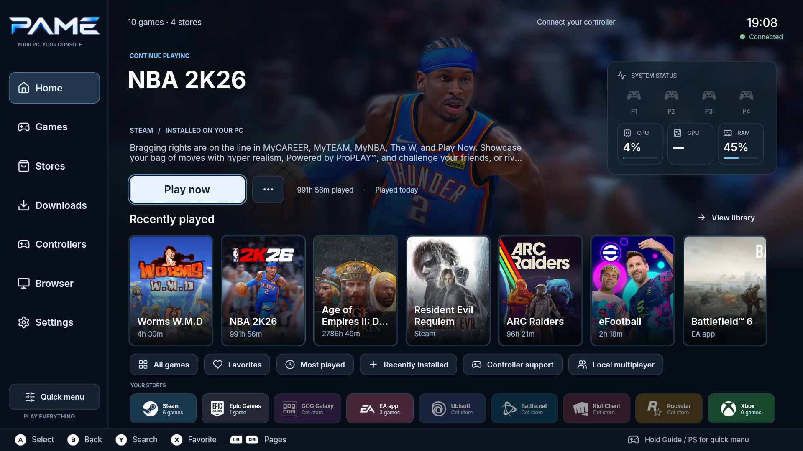
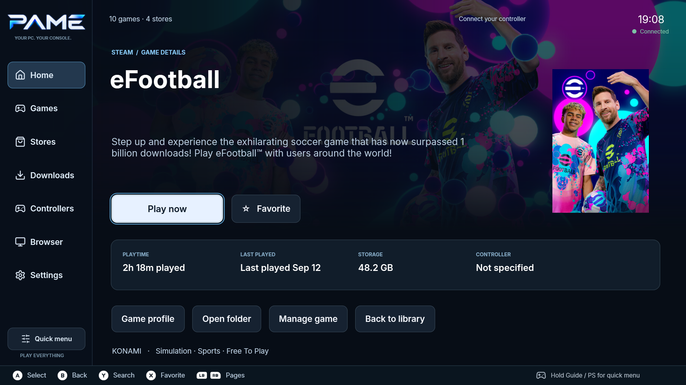
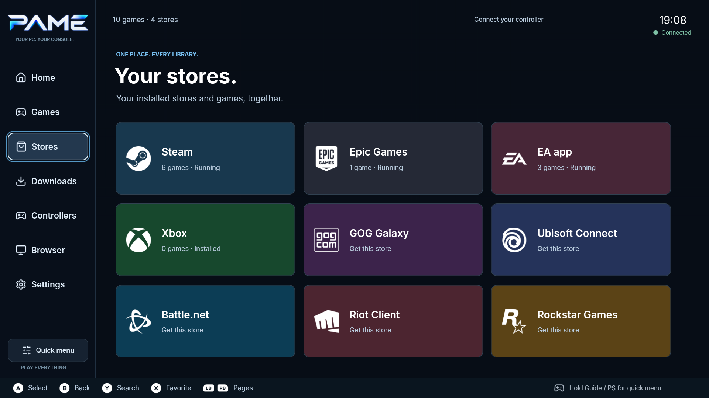
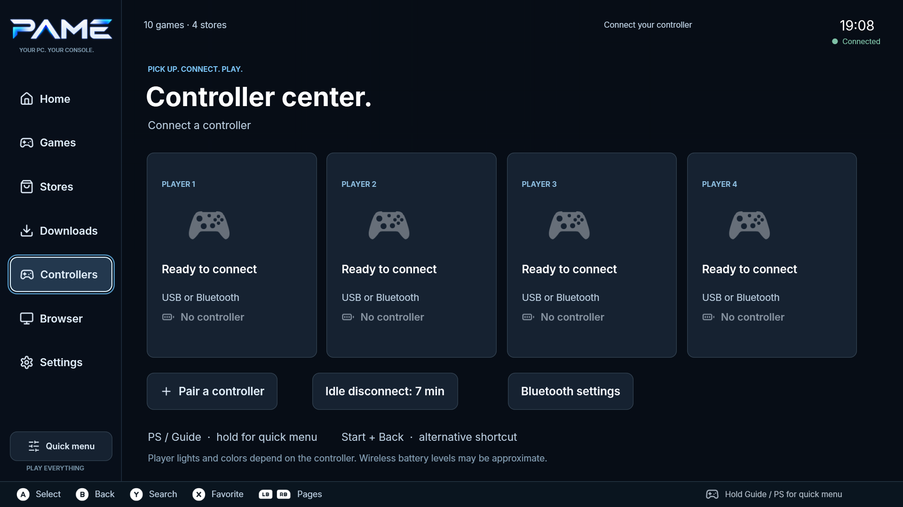

  

  <strong><a href="https://github.com/LielZ/Pame/releases/download/v0.4.1/Pame-Setup-0.4.1-x64.exe">Download for Windows</a></strong>
  &nbsp; · &nbsp;
  <a href="https://github.com/LielZ/Pame/releases/tag/v0.4.1">Release notes</a>
  &nbsp; · &nbsp;
  <a href="docs/USER_GUIDE.md">User guide</a>
  &nbsp; · &nbsp;
  <a href="https://github.com/LielZ/Pame/issues">Feedback</a>

PUBLIC ALPHA 0.4.1 &nbsp; / &nbsp; WINDOWS 10 2004+ &nbsp; / &nbsp; x64

Pame brings your installed PC games, stores, media and system controls into one fullscreen interface designed for a controller. Settle into the couch, pick a game and play. When you're done, Pame brings you back home.

Actual Pame 0.4.1 application capture. Game artwork comes from the installed library; games are not included.

## Built for the couch

| Your games, together | Your controller, throughout |
| :--- | :--- |
| **One game library.** Browse supported installed libraries, recent games and favorites. Search, filter and open game details from the same place. | **Controller navigation.** Move through menus, type with an onscreen keyboard and use the sticks as a mouse when Windows or a store needs your attention. |
| **A smooth trip into a game.** Pame minimizes open windows, hides the taskbar and desktop icons, displays the game's artwork as your wallpaper, and returns when play ends. | **A Quick menu during play.** Reach audio, controllers, system controls, the browser and supported media without putting down the controller. |
| **Media inside Pame.** The embedded browser has tabs and favorites. The Quick menu player switches between supported media sources with the right stick. | **Your choice of background activity.** Choose which supported apps and optional services Pame adjusts during play. It restores its changes afterwards and hides reopened app windows. |

Pame works with your existing Windows installation and stores. Store sign-ins, purchases, downloads, DRM and anti-cheat remain with their providers.

## Inside Pame

### Every game gets its own space

Artwork, playtime, favorites and game controls in a layout you can use from across the room.

<table>
  <tr>
    <td width="50%"></td>
    <td width="50%"></td>
  </tr>
  <tr>
    <td><strong>Your stores in one place</strong> See installed stores and open their launchers from Pame.</td>
    <td><strong>Ready for your controllers</strong> Four player slots, connection notices and a configurable low-battery alert.</td>
  </tr>
</table>

## Start playing

1. **[Download the Windows installer](https://github.com/LielZ/Pame/releases/download/v0.4.1/Pame-Setup-0.4.1-x64.exe)** and run it. The .NET runtime is included; setup installs Microsoft WebView2 if needed.
2. **Open Pame and connect a controller.** Your supported installed libraries are discovered automatically. Sign into your stores if prompted.
3. **Choose a game.** Hold PS / Guide / Home for the Quick menu. Explore **Settings** to customize appearance, sound and background activity.

Requires Windows 10 version 2004 or later, x64. This is an unsigned alpha; see [known limitations](KNOWN_LIMITATIONS.md). Optional Windows service access is off by default and can be enabled during setup. Upgrading preserves your library and settings.

## Explore the project

| | |
| :--- | :--- |
| **[User guide](docs/USER_GUIDE.md)** | Setup, controller shortcuts, browser controls, recovery and local data. |
| **[What's new](CHANGELOG.md)** | Changes across Pame releases. |
| **[Build from source](docs/USER_GUIDE.md#develop)** | .NET 10 / WPF development and Windows packaging. |
| **[Validation](docs/VALIDATION-0.4.1.md)** | Automated checks and native integration results for 0.4.1. |
| **[Known limitations](KNOWN_LIMITATIONS.md)** | Current compatibility and alpha constraints. |
| **[Report an issue](https://github.com/LielZ/Pame/issues)** | Bugs, controller compatibility and feature requests. |

  Pame is an independent project. Game, store and controller brands belong to their owners. 
  <a href="THIRD_PARTY_NOTICES.md">Third-party notices</a> · <a href="DEPENDENCIES.md">Dependencies</a> · <a href="https://github.com/LielZ/Pame/releases/download/v0.4.1/SHA256SUMS.txt">Installer checksum</a>

